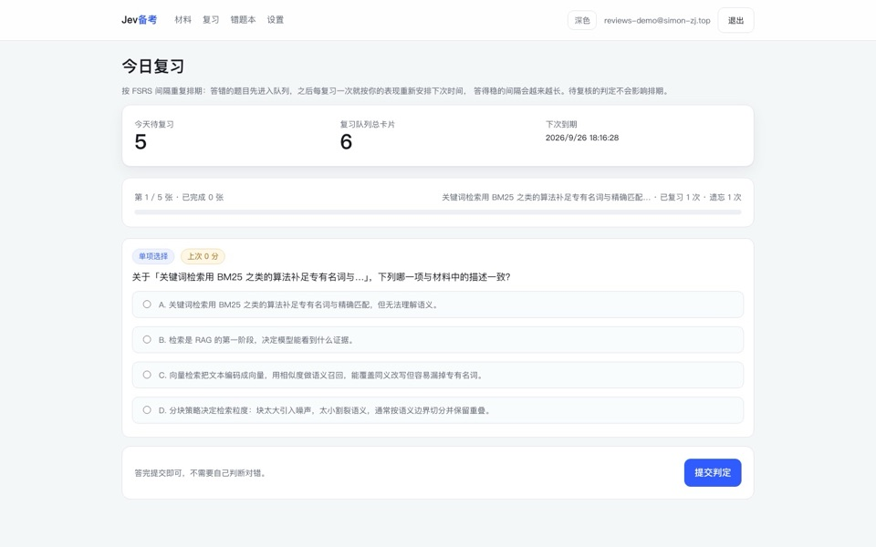

<p align="center">
  
</p>

<h1 align="center">Jev Exam Prep</h1>

<p align="center">
  <strong>Turn your own study material into an exam that grades itself point by point — and tells you which idea you failed to express.</strong>
</p>

<p align="center">
  <a href="README.md"><strong>English</strong></a> ·
  <a href="README.zh-CN.md">中文</a> ·
  <a href="https://www.simon-zj.top/demo/jev-exam-report.html">Demo report</a> ·
  <a href="SKILL.md">Agent Skill</a> ·
  <a href="SECURITY.md">Security</a> ·
  <a href="CHANGELOG.md">Changelog</a>
</p>

<p align="center">
  
  
  
  
  
</p>

The point of this project is not "let a model give a score". It is to decompose **grading** into a set of
atomic, checkable questions, decide each of them with a decision model (TypeSafe Jev / System One), and
combine the probabilities in code. Every point in the final score can be audited in the report.




> Screenshots come from the offline demo mode (the fallback engine used when no API key is configured), so
> question style is mechanical and grading uses lexical overlap instead of Jev. With `TYPESAFE_API_KEY` the
> UI is identical and the grading quality is not.
>
> **To see the output without installing anything**, open the
> [hosted sample report](https://www.simon-zj.top/demo/jev-exam-report.html) (single file, fully offline),
> or the copy in the repository at [docs/demo/report.html](docs/demo/report.html).

## Three guarantees you can check

| Guarantee | How | Where |
| --- | --- | --- |
| **Material facts are locatable** | `source_anchor` and `evidence_span` must appear verbatim in the material; failures are listed as violations | `src/lib/provenance.ts` |
| **Coverage is not faked** | The material is split into units, and units covered by no question are listed as uncovered (`9/14`) | `src/lib/coverage.ts` |
| **Uncertainty is surfaced** | A weakly judged key point turns the question into "needs review" with a score range, excluded from mastery | `src/lib/grading/subjective.ts` |

Every field in the report is tagged **material** (locatable verbatim) or **model-added** (generated).

## How it works

| Step | Owner | Note |
| --- | --- | --- |
| Reading material, writing questions and rubric points | a generative LLM / your agent | Jev generates no text, so it cannot do this |
| Objective grading | deterministic code | normalised comparison; only cloze triggers one semantic-equivalence question |
| Written-answer grading | Jev (one `noul` per rubric point) | the probability is the point score; code weights and combines them |

Jev is a **decision model**: text or state in, typed probabilities out (`noul` 0–1, a `choice` distribution,
a `score` on an ordered rubric). It returns no text, no rationale and does no arithmetic. Since `noul`
carries no confidence field, this project measures judgment strength as `strength = |p − 0.5| × 2`.

Swapping engines requires implementing one interface, `DecisionEngine` ([src/lib/types.ts](src/lib/types.ts)).

## Usage

### 1. Web app (full loop)

```bash
npm install
cp .env.example .env      # optional: it runs without any key in offline demo mode
npm run dev               # http://localhost:3000
```

Invite codes, material library, topic confirmation, answering, a point-level report, a mistake log,
**spaced review (FSRS-5)**, daily quotas and BYOK keys are all included.

Mistakes are not just collected: after you submit, every question you lost points on enters the review
queue (due the same day), and each review maps the judged score onto an FSRS rating that pushes the next
due date out. Handwritten answers that cannot be auto-judged can be self-rated. The review page shows due
cards with overdue days and learning state, and the dashboard shows how many cards are due today.

### 2. Agent Skill / CLI (no server)

```bash
git clone https://github.com/Simon-zj1/jev-exam.git ~/.agents/skills/jev-exam    # Codex / Copilot CLI
git clone https://github.com/Simon-zj1/jev-exam.git ~/.claude/skills/jev-exam    # Claude Code
cd ~/.agents/skills/jev-exam && npm install
```

Then say "quiz me on this material": the agent writes `exam.json` following [SKILL.md](SKILL.md), and the
scripts handle verification, grading and rendering.

```bash
npx tsx scripts/study.ts verify  --material examples/agent-interview-notes.md --exam exam.json --strict
npx tsx scripts/study.ts answer-template --exam exam.json --out answers.json
npx tsx scripts/study.ts grade   --material examples/agent-interview-notes.md --exam exam.json \
                                 --answers answers.json --out ./learning_work --engine auto
```

The output is a **self-contained offline report** (`report.html`) with no external requests or CDN assets.

## Requirements

### Supported model providers (bring your own key)

The platform adapts the endpoint and default model; you pick a provider and paste a key.
Providers reachable from mainland China come first in the settings UI.

| Provider | Base URL (auto-filled) | Default model |
| --- | --- | --- |
| DeepSeek | `https://api.deepseek.com/v1` | `deepseek-chat` |
| 智谱 GLM | `https://open.bigmodel.cn/api/paas/v4` | `glm-4.6` |
| 通义千问 (Aliyun Bailian) | `https://dashscope.aliyuncs.com/compatible-mode/v1` | `qwen-plus` |
| Kimi (Moonshot) | `https://api.moonshot.cn/v1` | `kimi-k2-turbo-preview` |
| MiniMax | `https://api.minimax.chat/v1` | `MiniMax-Text-01` |
| SiliconFlow | `https://api.siliconflow.cn/v1` | `deepseek-ai/DeepSeek-V3` |
| OpenAI | `https://api.openai.com/v1` | `gpt-5-mini` |
| Anthropic | `https://api.anthropic.com/v1` | `claude-haiku-4-5` |
| Google Gemini | `.../v1beta/openai` | `gemini-2.5-flash` |
| OpenRouter / Groq / xAI / Vercel Gateway | provider-specific | see settings |
| Local (Ollama / vLLM / LM Studio) | `http://localhost:11434/v1` | `qwen3:8b` |

Settings has a **Test connection** button that verifies key + endpoint + model and explains common
failures (401 / 404 / 429 / network) in plain language.

### Deploy the web app

`docs/deploy.md` walks through Vercel + a hosted Postgres, environment variables, a custom subdomain,
and a pre-launch checklist. One-click button:

[](https://vercel.com/new/clone?repository-url=https%3A%2F%2Fgithub.com%2FSimon-zj1%2Fjev-exam&env=AI_API_KEY&project-name=jev-exam&repository-name=jev-exam)

### Compatibility

| Item | Requirement | If missing |
| --- | --- | --- |
| Node.js | ≥ 20 | cannot run |
| Database | Postgres in production | falls back to in-memory storage (cleared on restart) |
| Grading | `TYPESAFE_API_KEY` (Jev) | falls back to the LLM judge, then to a lexical demo engine (clearly labelled) |
| Question generation | `PLATFORM_LLM_API_KEY` (OpenAI-compatible) | falls back to an offline heuristic generator |
| Material format | plain text / Markdown | extract PDFs and EPUBs to text first |

## Verification

```bash
npm test            # unit, integration and HTTP-level tests
npm run typecheck
npm run build
npm run eval:judge -- --enforce --consistency 5
```

The evaluation script reports per-point accuracy, Brier score, calibration buckets, review rate and
self-consistency, gated at ≥ 90% accuracy with monotonic calibration. The offline demo engine scores
**71.4% per-point accuracy with a Brier score of 0.216** and monotonic calibration, but flags 9 of the 12
questions as needing review because its judgment strength is too low — that is the argument for using a
calibrated decision model instead of word overlap.

## Security

Uploaded material is treated as untrusted data: instructions found inside it are never executed, and a
scanner flags prompt injection, role hijacking and script injection. The provenance contract keeps generated
content from masquerading as a quoted source. See [SECURITY.md](SECURITY.md).

## License

[MIT](LICENSE) © 2026 Simon · More at [www.simon-zj.top](https://www.simon-zj.top/tech/tools/jev-exam/)
