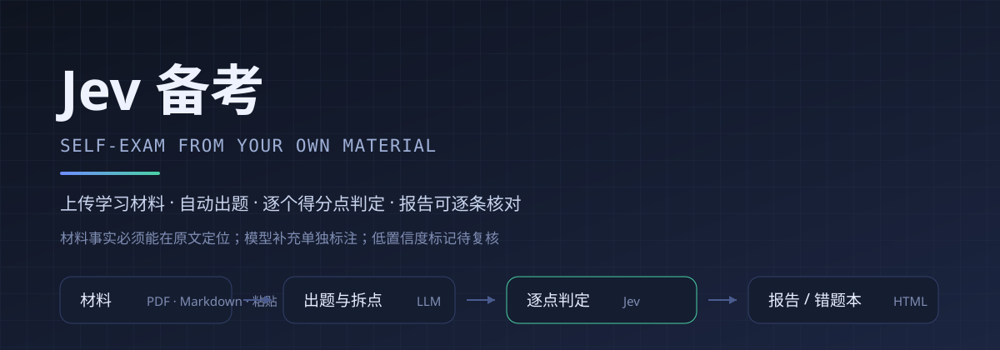
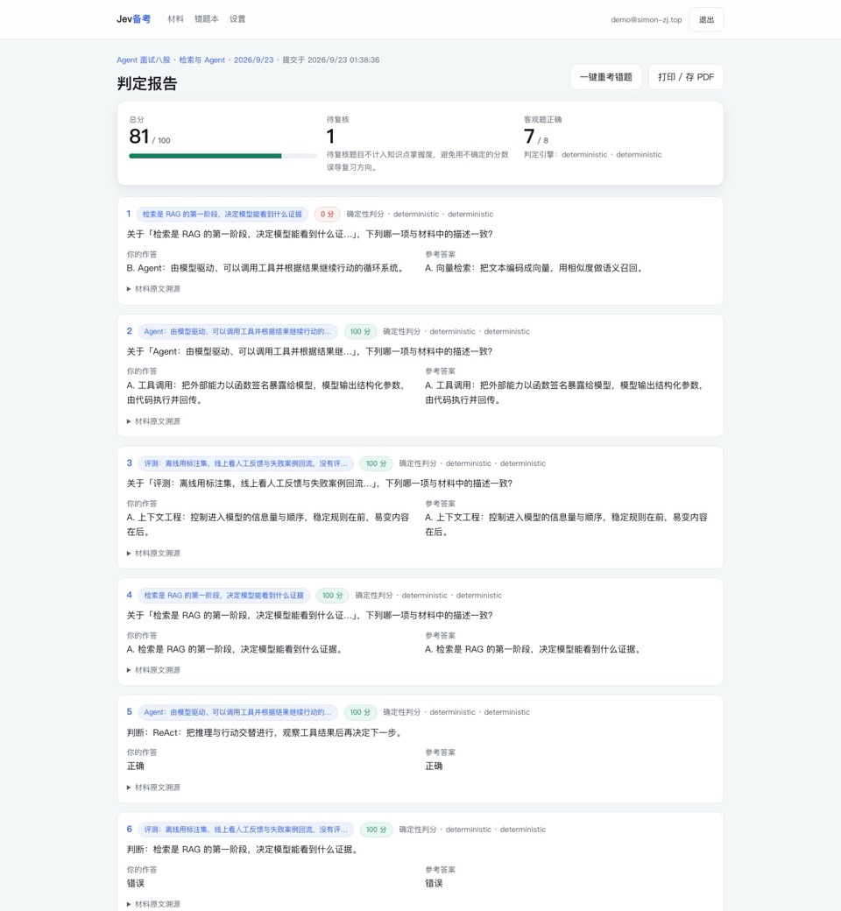
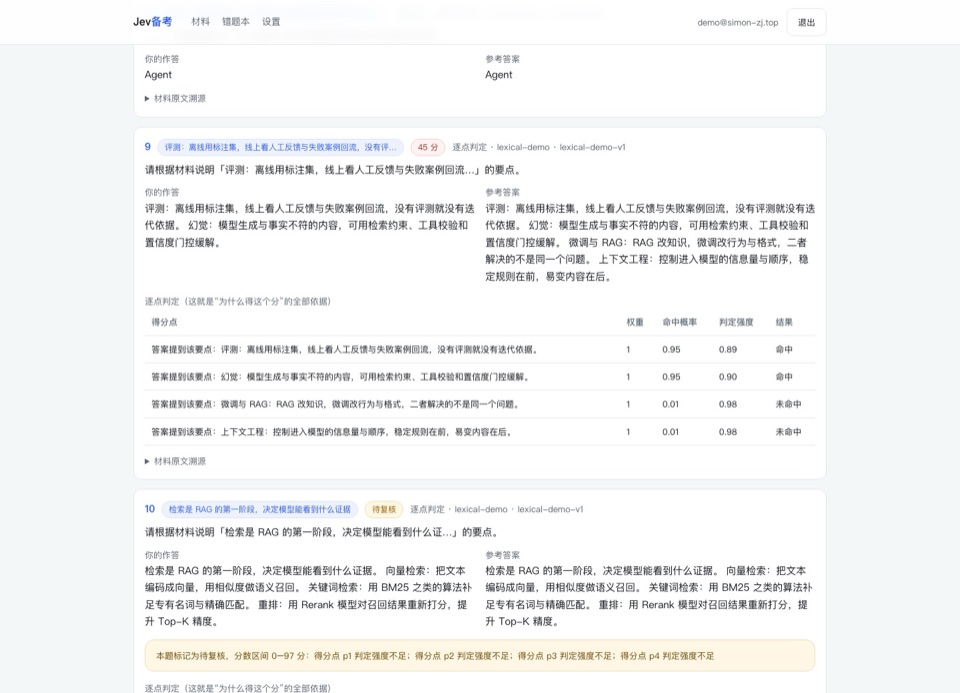
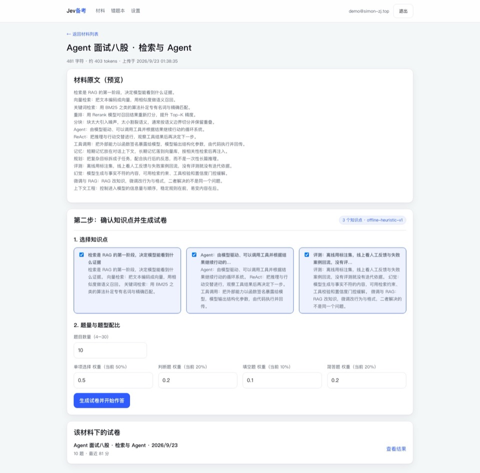
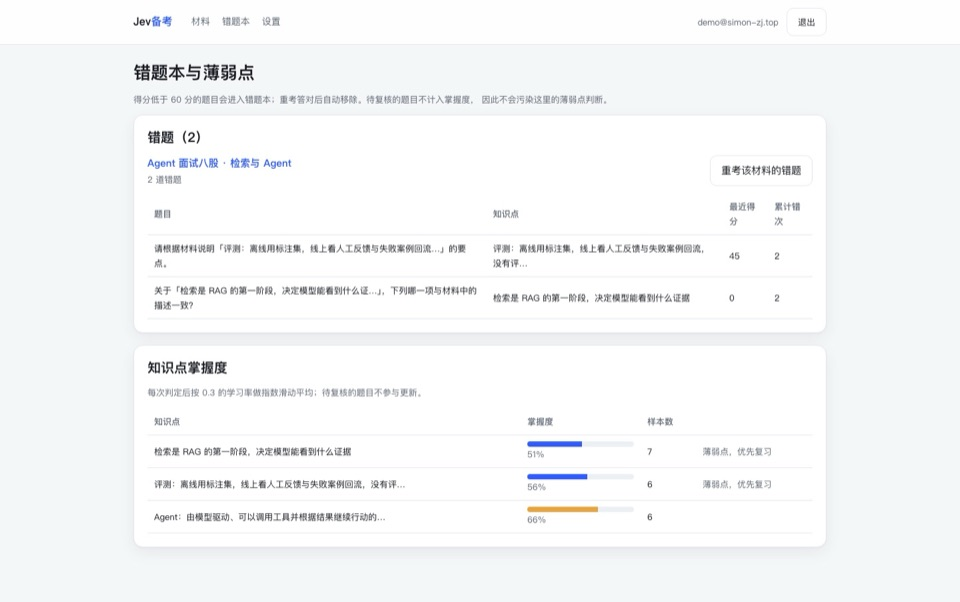

<p align="center">
  
</p>

<h1 align="center">Jev 备考 · Jev Exam Prep</h1>

<p align="center">
  <strong>上传你自己的学习材料，自动出题，用决策模型逐个得分点判定，并告诉你"哪一句没说到"。</strong>
</p>

<p align="center">
  <a href="README.md">English</a> ·
  <a href="README.zh-CN.md"><strong>中文</strong></a> ·
  <a href="https://www.simon-zj.top/demo/jev-exam-report.html">示例报告</a> ·
  <a href="docs/architecture.md">架构与取舍</a> ·
  <a href="SKILL.md">Agent Skill</a> ·
  <a href="SECURITY.md">安全边界</a> ·
  <a href="CHANGELOG.md">更新日志</a>
</p>

<p align="center">
  
  
  
  
  
  
</p>

这个项目的核心不是「让模型给个分」，而是把**判定**拆成一批原子的、可核对的问题，用决策模型
（TypeSafe Jev / System One）逐个判定，再由代码合成分数。分数为什么是这样的，可以在结果页逐条核对。

## 界面









> 截图来自本地离线演示模式（未配置 API key 时的降级引擎），所以出题风格偏机械、
> 判定用的是词面近似而非 Jev。接入 `TYPESAFE_API_KEY` 后界面一致，判定质量不同。
>
> **想直接看产物而不安装任何东西**：打开
> [在线示例报告](https://www.simon-zj.top/demo/jev-exam-report.html)（单文件、离线可读），
> 或看仓库里的 [docs/demo/report.html](docs/demo/report.html)。
>
> 上图为 960px 版本；完整三档（1440 / 960 / 640 + 手机裁剪）在
> [在线图文说明](https://www.simon-zj.top/tech/tools/jev-exam/)里，手机端会自动换用可读的裁剪版，
> 点击图片可放大查看完整截图。

## 三个可核对的保证

这三个是「凭什么相信这个分数」的全部依据，也是本项目和「让 LLM 打个分」的区别：

| 保证 | 做法 | 在哪里 |
| --- | --- | --- |
| **材料事实可定位** | `source_anchor`、`evidence_span` 必须逐字出现在原文，定位失败记为违规并在报告里列出 | `src/lib/provenance.ts` |
| **覆盖率不假装完整** | 把材料切成要点单位，列出没有被任何题目覆盖的句子，如实显示「覆盖 9/14」 | `src/lib/coverage.ts` |
| **不确定就标出来** | 判定强度不足的得分点让整题变为「待复核」，给出分数区间，且不计入掌握度 | `src/lib/grading/subjective.ts` |

报告里每个字段都带来源标签：**材料原文**（可在材料中逐字定位）或**模型补充**（模型生成，允许改写措辞）。

## 这个项目在做什么

三个环节分工是固定的，不能混：

| 环节 | 由谁负责 | 说明 |
| --- | --- | --- |
| 材料理解、出题、评分点拆解 | 生成式 LLM / 你的 Agent | Jev 不生成任何文字，这一步它做不了 |
| 客观题判分 | 确定性代码 | 归一化后精确比对；只有填空需要「语义等价」时才调用一次 noul |
| 要点式主观题判分 | Jev（每个得分点一条 noul） | 概率即得分率，代码按权重合成，并施加矛盾/编造扣分 |

### Jev 在其中的位置

Jev（TypeSafe 的 System One / Decision Model）是**判定引擎**，不是校验框架：

- 输入是 `state`（材料、题目、学生作答）和一组类型化问题；
- 输出是类型化概率：`noul`（是/否概率 0–1）、`choice`（选项 + 概率分布 + confidence）、
  `score`（有序 rubric 分数 + confidence）；
- 它不生成文字、不给理由、不做算术；`noul` 没有 confidence 字段，因此本项目用
  `strength = |p − 0.5| × 2` 衡量判定强度；
- 实测成本极低（输入 $0.042/百万 token，输出免费），所以「一个得分点一条问题」这种暴力拆解是可负担的。

换引擎只需实现 `DecisionEngine`（[src/lib/types.ts](src/lib/types.ts)）这一个接口，业务代码不用动。

## 两种用法

### 用法一：Web 应用（完整闭环）

```bash
npm install
cp .env.example .env        # 可选：不配置任何密钥也能跑（离线演示模式）
npm run dev                 # http://localhost:3000
```

首次登录需要一个邀请码。本地可以直接给一个：

```bash
echo 'INITIAL_INVITE_CODES=DEV-INVITE' >> .env
```

Web 版包含：邀请制登录、材料库、知识点确认、作答、逐点判定报告、错题本与掌握度、**间隔重复复习（FSRS-5）**、每日额度、BYOK。

错题不只是被记下来：交卷后失分的题目会立刻进入复习队列（当天可重来），
复习时按判定分数自动映射成 FSRS 评分并推进下一次到期时间；
手写作答等无法自动判定的场景可以自评。复习页展示到期卡片、逾期天数与掌握状态，
仪表盘显示「今天有几张卡到期」。

### 用法二：Agent Skill / 命令行 / MCP（零服务器）

```bash
git clone https://github.com/Simon-zj1/jev-exam.git ~/.agents/skills/jev-exam   # Codex / Copilot CLI
git clone https://github.com/Simon-zj1/jev-exam.git ~/.claude/skills/jev-exam   # Claude Code
cd ~/.agents/skills/jev-exam && npm install
```

装好后在对话里说「用这份材料考我」——Agent 按 [SKILL.md](SKILL.md) 出题，脚本负责校验、判定与渲染：

```bash
npx jev-exam verify  --material examples/agent-interview-notes.md --exam exam.json --strict
npx jev-exam answer-template --exam exam.json --out answers.json
npx jev-exam grade   --material examples/agent-interview-notes.md --exam exam.json \
                     --answers answers.json --out ./learning_work --engine auto
npx jev-exam render  --report learning_work/report.json --out report.html
```

> 包已按 npm 发布形态配置好（`bin` / `files` / `publishConfig`）。如果 `npx jev-exam` 报 404，
> 说明还没发布；可以先用仓库内的等价命令，或直接从 GitHub 跑：
>
> ```bash
> npx tsx scripts/study.ts verify --material ... --exam ...   # 已 clone 并 npm install
> npx github:Simon-zj1/jev-exam verify --material ... --exam ...  # 不 clone
> npm publish   # 想发到 npm 时（需要先 npm login）
> ```

产物是**离线单文件报告**（无外部请求、无字体/CDN 依赖）：`report.json` + `report.html` + `report.md`。

不想用 shell 的 Agent 可以直接挂 MCP server（四个工具：校验 / 出模板 / 判分 / 渲染）：

```bash
claude mcp add jev-exam -- npx -y jev-exam@latest mcp
```

```json
{ "mcpServers": { "jev-exam": { "command": "npx", "args": ["-y", "jev-exam@latest", "mcp"] } } }
```

仓库里还带了给编码 Agent 的规则（[AGENTS.md](AGENTS.md)、`.cursor/rules/`）与
[llms.txt](llms.txt)，避免别人改这个仓库时破坏「材料事实必须可定位」「判定必须走 DecisionEngine」这些契约。

### 一键部署 Web 版

[](https://vercel.com/new/clone?repository-url=https%3A%2F%2Fgithub.com%2FSimon-zj1%2Fjev-exam&env=AI_API_KEY&envDescription=%E5%87%BA%E9%A2%98%E6%A8%A1%E5%9E%8B%E7%9A%84%20key&project-name=jev-exam&repository-name=jev-exam)

只问一个变量：`AI_API_KEY`。不配置任何 key 也能部署成功，会运行在离线演示模式（界面会标注）。

### 三种运行模式

| 模式 | 触发条件 | 出题 | 判定 | 用途 |
| --- | --- | --- | --- | --- |
| 生产 | `TYPESAFE_API_KEY` + `PLATFORM_LLM_API_KEY` | LLM 出题 | Jev 判定 | 真实使用 |
| 自带密钥 | 用户在设置里填 BYOK | 用户自己的 LLM | 用户自己的 Jev | 不占平台额度 |
| 离线演示 | 没有任何密钥 | 离线启发式 | 词面相似度 | 本地联调与自动化测试 |

**离线演示模式的判定质量很低**（词面重合近似「是否覆盖该得分点」），界面上会明确标注。
它存在的意义是让整条闭环、额度、门控、错题本在没有外部依赖时也能被测试覆盖。

## 运行要求与兼容性

### 支持哪些模型服务商（自带 Key）

你只需要选服务商、粘 Key；接口地址与默认模型由平台适配。设置页里国内可直连的排在前面。

| 服务商 | 接口地址（自动填好） | 默认模型 |
| --- | --- | --- |
| DeepSeek | `https://api.deepseek.com/v1` | `deepseek-chat` |
| 智谱 GLM | `https://open.bigmodel.cn/api/paas/v4` | `glm-4.6` |
| 通义千问（阿里云百炼） | `https://dashscope.aliyuncs.com/compatible-mode/v1` | `qwen-plus` |
| Kimi（月之暗面） | `https://api.moonshot.cn/v1` | `kimi-k2-turbo-preview` |
| MiniMax | `https://api.minimax.chat/v1` | `MiniMax-Text-01` |
| 硅基流动（多模型聚合） | `https://api.siliconflow.cn/v1` | `deepseek-ai/DeepSeek-V3` |
| OpenAI | `https://api.openai.com/v1` | `gpt-5-mini` |
| Anthropic | `https://api.anthropic.com/v1` | `claude-haiku-4-5` |
| Google Gemini | `.../v1beta/openai` | `gemini-2.5-flash` |
| OpenRouter / Groq / xAI / Vercel | 见设置页 | 见设置页 |
| 本地模型（Ollama / vLLM / LM Studio） | `http://localhost:11434/v1` | `qwen3:8b` |

设置页有「**测试连接**」：粘完 Key 立刻验证「地址 + Key + 模型」三件事，
并把 401 / 404 / 429 / 网络不通翻译成中文提示。

### 部署 Web 版

`docs/deploy.md` 里有完整步骤：Vercel + 托管 Postgres、环境变量、绑定自己的子域名、上线检查清单。一键按钮：

[](https://vercel.com/new/clone?repository-url=https%3A%2F%2Fgithub.com%2FSimon-zj1%2Fjev-exam&env=AI_API_KEY&project-name=jev-exam&repository-name=jev-exam)

| 项目 | 要求 | 缺失时的行为 |
| --- | --- | --- |
| Node.js | ≥ 20（开发用 22 验证） | 无法运行 |
| 数据库 | 生产需要 Postgres（Supabase / Neon / 自建） | 未设置 `DATABASE_URL` 时使用内存存储，重启即清空 |
| 判定引擎 | `TYPESAFE_API_KEY`（Jev） | 回落到 LLM 判定；都没有则用离线词面引擎并明确标注 |
| 出题模型 | `PLATFORM_LLM_API_KEY`（OpenAI 兼容 `/chat/completions`） | 回落到离线启发式出题器 |
| Agent 环境 | 能读文件、能跑本地命令、识别 `SKILL.md` | 只能用 Web 版；纯聊天环境无法完成校验与渲染 |
| 材料格式 | 纯文本 / Markdown（Web 版为粘贴） | PDF/EPUB 请先自行抽取为文本 |

## 环境变量

| 变量 | 必需 | 说明 |
| --- | --- | --- |
| `DATABASE_URL` | 生产必需 | Postgres 连接串；未设置时使用内存存储 |
| `SESSION_SECRET` | 生产必需 | 会话签名 + BYOK 加密密钥（scrypt 派生） |
| `TYPESAFE_API_KEY` | 生产必需 | Jev 判定 |
| `TYPESAFE_BASE_URL` / `TYPESAFE_MODEL` | 可选 | 默认 `https://api.typesafe.ai` / `jev-latest` |
| `AI_API_KEY` | 推荐 | 出题模型的单 key，provider 从 key 形状推断（`sk-ant-` Anthropic / `sk-or-` OpenRouter / `AIza` Google / `gsk_` Groq / `xai-` xAI / `vck_` Vercel Gateway / `sk-` OpenAI） |
| `AI_PROVIDER` | 可选 | key 没有可识别前缀时指定（`mistral` / `deepseek`） |
| `AI_BASE_URL` / `CHAT_MODEL` | 可选 | 指向任何 OpenAI 兼容服务（Ollama / LM Studio / vLLM）与自定义模型名 |
| `PLATFORM_LLM_API_KEY` | 可选 | 显式方式，设置后优先于 `AI_API_KEY` |
| `PLATFORM_LLM_BASE_URL` / `PLATFORM_LLM_MODEL` | 可选 | 默认 `https://api.openai.com/v1` / `gpt-5-mini` |
| `INITIAL_INVITE_CODES` | 可选 | 逗号分隔，首次启动写入邀请码（每个默认 3 次） |

## 判定逻辑

### 客观题（确定性判分）

- 单选按选项下标、判断按布尔值精确比对；
- 填空先做归一化比对（NFKC、大小写、全半角、标点、`答案：` 前缀），命中 `accepted` 列表即得分；
- 字面不一致时才调用一次 `noul`（「学生答案与标准答案是否语义等价」），
  `strength < 0.5` 则标记待复核而不是猜一个分。

### 主观题（逐点判定）

1. 每个 rubric 点生成一条 `noul`，`instructions` 里把该得分点本身作为结构化字段带进去
   （`question / inspect / point{statement, evidence_span, weight} / focus`），并附
   `criteria.true/false` 的 `what / not_for / examples`（对照式定义，减少歧义）。
   注意：Jev 的多个问题是并行、互相独立的，如果所有问题共享同一段指令而只靠 key 区分，
   模型无法知道自己在判哪一点——这是判定质量的隐形杀手；
2. 额外两条防护问题：是否与材料或参考答案**矛盾**、是否引入了材料之外的**具体事实**；
3. 合成：

   ```
   score = Σ(weightᵢ × noulᵢ) / Σweightᵢ − 0.3×P(矛盾) − 0.3×P(编造)
   ```

   扣分系数在代码里写死（[src/lib/config.ts](src/lib/config.ts)），不交给模型决定；
4. 门控：任意关键得分点（权重 ≥ 0.2）判定强度不足，或矛盾/编造检查自身不确定，
   整题标记**待复核**，结果页给出分数区间，并且**不计入知识点掌握度**。

### 额度

- 每人每日：材料 3 份、题目 100 道、判定 1000 次（[src/lib/config.ts](src/lib/config.ts)）；
- 按 Asia/Shanghai 自然日重置；
- 使用自带密钥（BYOK）的调用不占平台额度；
- 闸门在「生成试卷」与「提交判定」两个入口，超限返回 429。

## 数据模型

核心表（[src/lib/db/schema.ts](src/lib/db/schema.ts)）：

| 表 | 作用 |
| --- | --- |
| `users` / `invite_codes` | 邀请制账号，BYOK 密钥加密列 |
| `materials` | 原始材料（纯文本/Markdown） |
| `exam_blueprints` | 知识点大纲（每份材料一份，带版本） |
| `questions` | 题目 + 答案键 + rubric 点 + 原文锚点 |
| `exams` / `exam_questions` | 试卷与题目顺序（错题重考复用原题） |
| `attempts` / `answers` / `judgments` | 作答、判定结果、引擎版本、原始响应 |
| `mastery` / `mistake_items` | 知识点掌握度（EMA，学习率 0.3）与错题本 |
| `review_items` / `review_logs` | 复习卡片（FSRS-5 状态：stability/difficulty/reps/lapses/state/due_at）与每次复习日志 |
| `usage_counters` | 每日额度计数 |

迁移：

```bash
npm run db:generate   # 依据 schema 生成 SQL 迁移到 ./drizzle
npm run db:push       # 直接推送到目标库
```

Postgres 路径在测试里用 PGlite（进程内 Postgres）真实执行迁移与查询，
所以 schema 与 SQL 不是「只过了类型检查」。

## 测试与评测

```bash
npm test                                       # 单元 + 集成 + HTTP 层
npm run typecheck
npm run build
npm run eval:judge                             # 判定层评测（当前环境引擎）
npm run eval:judge -- --engine offline         # 离线演示引擎
npm run eval:judge -- --enforce --consistency 5
npm run demo:report                            # 重新生成 docs/demo 下的示例报告
```

CI（[.github/workflows/ci.yml](.github/workflows/ci.yml)）在每次 push/PR 跑完整同一条链：
`npm ci` → `typecheck` → `test` → `build` → `demo:report` → `eval:judge`（离线引擎，仅作反例对照）。

对已启动的服务跑一次真实闭环（登录 → 上传 → 出题 → 作答 → 判定 → 结果页）：

```bash
npm run build && npm run start -- -p 3111      # 另开一个终端
BASE_URL=http://localhost:3111 INVITE_CODE=DEV-INVITE npm run smoke
```

评测脚本会输出：逐点准确率、Brier 分数、校准分桶表、校准单调性、待复核比例、自一致性标准差。
金标准集在 [eval/golden/subjective.jsonl](eval/golden/subjective.jsonl)（当前 12 道，方案目标是 60–100 道），
每行是「材料片段 + 题目 + 学生作答 + 逐得分点人工标注」。

验收门槛（`--enforce` 时生效）：逐点准确率 ≥ 90% 且校准单调。
离线演示引擎达不到这个门槛是预期行为——它在金标准集上的实测是**逐点准确率 42.9%、Brier 0.56**，
置信度全部挤在一档。这个数字就是「词面重合不能替代校准过的判定模型」的量化证据，
也是本项目默认接入 Jev 的原因。

## 目录结构

```
AGENTS.md             给编码 Agent 的项目规则（判定链路 / 溯源契约 / 测试要求）
llms.txt              给 LLM 的项目索引（关键文件与命令）
SKILL.md               Agent Skill 入口（给 Codex / Claude Code 用）
scripts/study.ts       命令行：verify / grade / render / answer-template / demo
scripts/mcp-server.ts  MCP server：verify_exam / answer_template / grade_answers / render_report
scripts/eval-judge.ts  判定层评测（金标准集 + 校准分桶）
src/lib/engine/        判定引擎：typesafe(Jev) / llm-judge(对比基线) / lexical(离线演示)
src/lib/generator/     出题：LLM 出题器、离线出题器、落地校验（schema/锚点/去重）
src/lib/grading/       判分：客观题确定性判分、主观题逐点合成与门控
src/lib/coverage.ts    覆盖率校验（哪些材料要点没被出题覆盖）
src/lib/provenance.ts  溯源契约（材料事实 vs 模型补充）
src/lib/security/      不可信材料扫描、分隔符转义、HTML 转义
src/lib/report.ts      离线 HTML / Markdown 报告渲染
src/lib/db/            Drizzle schema、Store 接口、Postgres 与内存两种实现
src/lib/services/      业务服务层（材料、大纲、试卷、作答判定、结果、错题、BYOK）
src/app/api/           Route Handlers：HTTP 契约与测试入口
src/app/               页面：落地页/材料/大纲确认/作答（逐题判定进度）/判定报告/错题本/设置
docs/architecture.md   架构、数据流与取舍（面试可读）
docs/demo/             可直接打开的示例报告（由 scripts/study.ts 生成）
examples/              示例材料
.github/workflows/     CI：类型检查 + 测试 + 构建 + 生成示例报告
```

## 安全与隐私

上传的材料一律当作**不可信数据**：材料里的指令不会被执行，代码侧会扫描提示注入、角色劫持、
脚本注入等模式；「材料事实必须可定位」这条契约保证伪造内容无法伪装成原文。
密钥使用 AES-256-GCM 加密存储、只在该用户请求中使用；材料默认私有，删除会级联清除派生数据。
详见 [SECURITY.md](SECURITY.md)。

## 已知取舍

1. **认证**：MVP 使用「邀请码 + 邮箱 + 签名 Cookie」，接口抽象在
   [src/lib/auth/session.ts](src/lib/auth/session.ts) 的 `AuthProvider`。
   换成 Supabase Auth（邮箱 OTP）+ RLS 只需要替换该 provider，业务与路由不动。
2. **材料范围**：Web 版只支持粘贴纯文本/Markdown，不做 PDF 解析、OCR 与网页抓取。
3. **不做数学与代码判分**：计算类题目需要执行器/符号等价检查，Jev 只用于语义要点判定。
4. **结果页的解释**：Jev 不给理由，所以「为什么」只能来自 rubric 点本身
   （哪些点命中、哪些没命中、扣分项概率多少），不展示模型解释。
5. **待复核不自动复审**：低置信度题目只标记、不计入掌握度，不自动调用更强的模型改判。
6. **覆盖率不等于正确性**：覆盖率只说明「要点有没有被出题」，不说明题目本身出得好不好。

## 后续路线

- 把金标准集扩到 60–100 题并按知识点分层，接 CI 做回归；
- 接入 PDF/DOCX 解析与图片 OCR（引入视觉模型），并沿用「未核验区间」标记；
- Supabase Auth + RLS 的真实部署；
- 错题驱动的补题：覆盖率低的材料自动补出题目；
- 自托管决策模型（Kev 等开源复刻）作为 `DecisionEngine` 的第三种实现，摆脱对 TypeSafe 的依赖。

## 许可

[MIT](LICENSE) © 2026 Simon · 更多内容见 [www.simon-zj.top](https://www.simon-zj.top/tech/tools/jev-exam/)
